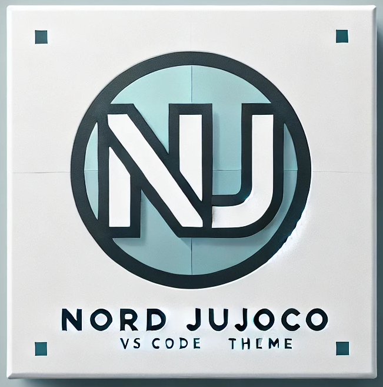
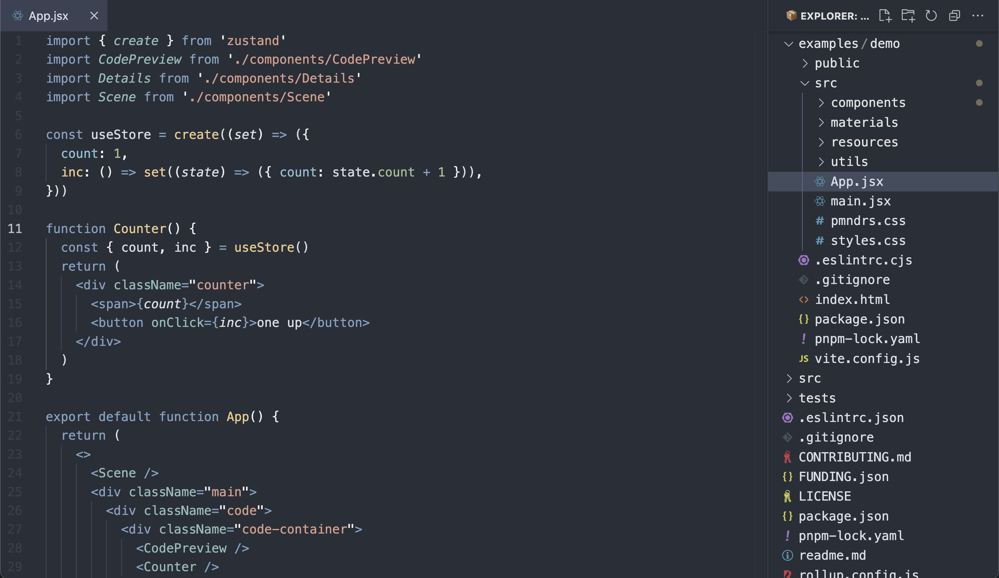

#  Nord Jujoco

  
  

  Nord Jujoco is the refined theme of the beloved Nord color palette, tailored for developers who value both aesthetics and functionality. This theme preserves the original calm and cool tones of Nord while introducing enhanced variable color differentiation for improved readability and developer productivity.
  

### Screenshot

### Installation

visit [Visual Studio Code Marketplace](https://marketplace.visualstudio.com/items?itemName=Jujoco.nord-jujoco) and click install.

or open your vscode plugins and search for `Nord Jujoco`.